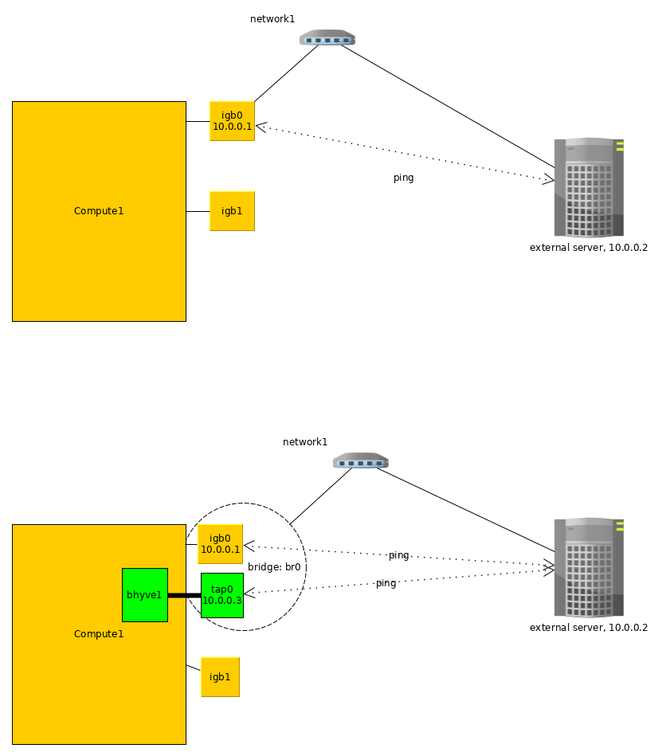
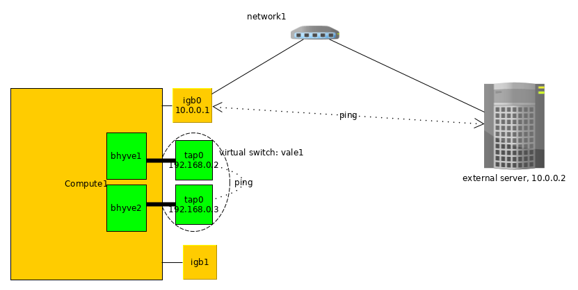

# CBSD Bhyve network options

So, there are the following network options:

*  1) Bridge network: e1000, virtio ( + NAT )
*  2) Point-to-point network from bhyve to hoster via tap: e1000, virtio
*  3) Private virtual switch via VALE: only virtio
*  4) Pass-thru and SR-IOV ( ppt device )

Options 1 by default:

## Options 1: Bridge network (auto)

When interface in bhyve settings sets to 'auto', CBSD try to:

*  a) determine default interface uplink via: 'route -n get 0.0.0.0'
*  b) create tap interface for bhyve
*  c) create bridge interface
*  d) add into bridge interface tap interface from bhyve and uplink interface

 So, networking similar to vnet/jail - each devices on L2 can exchange with bhyve direcrly and bhyve in the same L2 network as uplink interface

When interface in bhyve settings sets to any inteface behavior the same except (a) - interface already know

How to:

* 1) cbsd bconstruct-tui -> choose os_profile + jname -> [GO] (proceed)
* 2) cbsd bstart

## Options 2: Bridge network (manual)

If you want to control bridge/uplink by yourself this is method for you. You must initialize and configure the bridge interface yourself, regardless of CBSD> and select this bridgeX as VM interface

When interface of VM = bridge*, the CBSD will not configure and delete selected bridge when the virtual machine starts and stops.

How to:

* 1) cbsd bconstruct-tui -> choose os_profile + jname -> interface (select your bridge in the list) -> [GO] (proceed)
* 2) cbsd bstart

## Options 2: Point-to-point network from bhyve to hoster

 Direct network between bhyve and hoster. In this case, in order to give the network in the bhyve, it is necessary to enable routing of packets between bhyve and hoster tap networks. As a rule in this case, the default gateway for the bhyve instance is the host on which it is launched. No bridge, only tap.

How to:

*  1) cbsd bconstruc-tui -> choose os_profile + jname -> [GO] (proceed)
*  2) cbsd bconfig (choose vm)
*  3) (in bconfig): bhyvenic -> nic1 -> nic_parent -> [choose 'disabled']
*  4) cbsd bstart
*  5) (on hoster):
  find tap interface for bhyve (by description), e.g: tap2
  choose network for interconnect between hoster and bhyve, e.g:
  192.168.1.0/24
  set's one IP from this network in the hoster side:

  ifconfig tap2 192.168.1.1/24
*  6) via VNC enter into bhyve instance and sets second IP from this network:

  ifconfig vtnet0 up
  ifconfig vtnet0 192.168.1.2/24

  Now, bhyve can ping hoster via:

  ping 192.168.1.1

  And you can set default route to hoster and route traffic as usual:
  (on bhyve):
  route add default 192.168.1.1

  Also, bhyve with 192.168.1.1 available from hoster via 'ssh 192.168.1.2'

## Options 3: VALE switch

 We can create any number of virtual private switch via VALE. Bhyve which are commutated for example in 'vswitch1' can ping only each other VM in vswitch1, but nothing else.

For example:

[sw1]
|   \
b1   b2

[sw2]
|   \
b3   b4

bhyve (b1) can ping (b2), and (b3) can ping (b4), but other host is unavailable.

Howto:

*  1) create virtual switch:
*  cbsd valecfg-tui -> add name (e.g sw1)
*  2) cbsd bconstruc-tui -> choose os_profile + jname -> [GO] (proceed)
*  3) cbsd bconfig (choose vm)
*  4) (in bconfig): bhyvenic -> nic1 -> nic_parent -> [choose 'vale:sw1']
*  5) cbsd bstart

In this case, you can assign into bhyve any network/IPs - this is not available from any places.

If create second virtual machine and also attach to vale:sw1, this host can each other in VALE switch.

This options usefull for hosting and customer:

Each client receives personal private switch and its virtual machines are only connected to this switch. No collision between same network with other client! And to get internet access, client must install 'Gateway/Internet appliance' - small virtual machine like in Amazon AWS with two interfaces - one of them is connected to client's private switch (so that other machines can use it as a gateway) and second interface - connected to bridge on the hoster.

schematically it might look like this:

