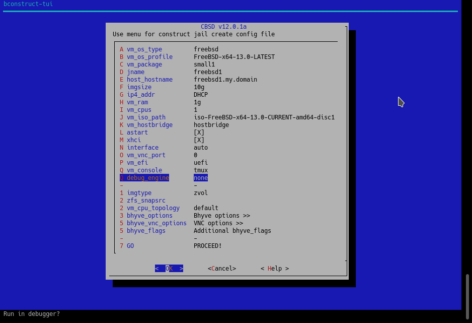
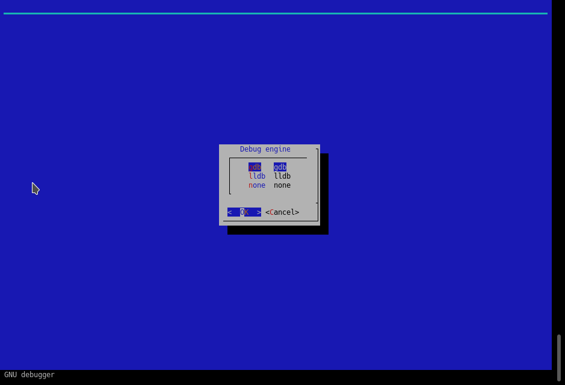
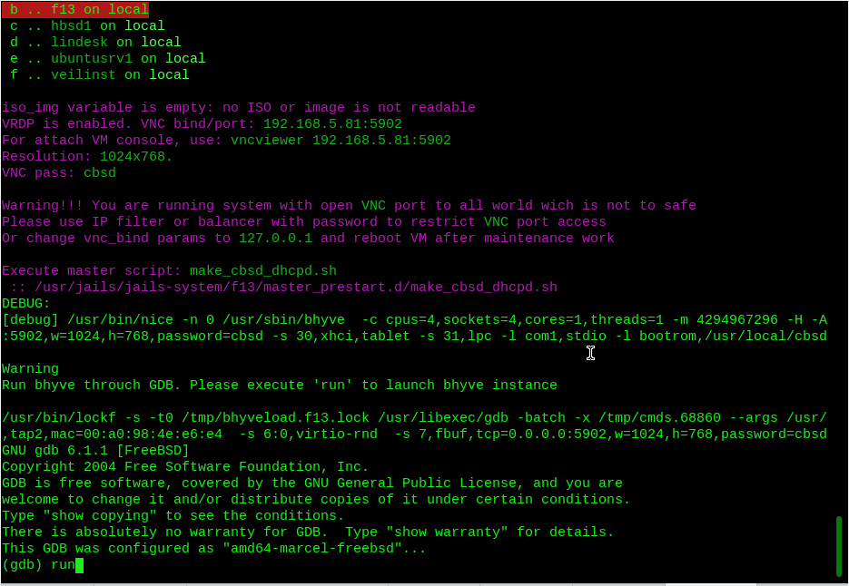
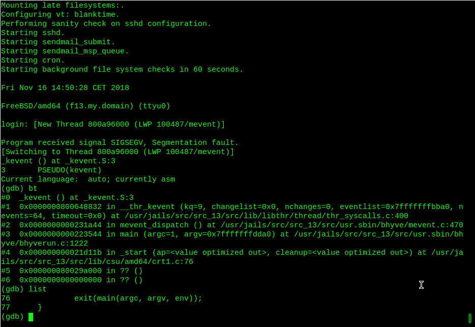

# Running the bhyve hypervisor in gdb/lldb via CBSD

**commands: bconfig, bconstruct-tui**

```
% cbsd bconstruct-tui
% cbsd bconfig
```
During the operation of bhyve, you may encounter problems inherent in any other software that man created. Namely - the bhyve process may die suddenly. This is an unpleasant situation and should not exist in an ideal world. You can bring the perfect world closer by correcting this error if you are a kernel hacker. But if you are not so, you can still help the project by filling out the maximum informative error report. With this problem we can be helped by the opportunity **CBSD** to run bhyve throuch gdb (GNU debuger) or lldb (LLVM) debuger. Also, this feature will be useful to bhyve developers or in any other research projects..

As an example, we give the situation with this crash [NetBSD](http://netbsd.org/) guest, when you turn on the xhci driver. In this case, we launched a NetBSD virtual machine with the lldb option and got a backtrace that was sent to [tech-kern maillist](http://mail-index.netbsd.org/tech-kern/2018/09/25/msg024102.html) of NetBSD and [bugs.freebsd.org](https://bugs.freebsd.org/bugzilla/show_bug.cgi?id=232084)

To launch bhyve through debugger, use the menu debug_engine in 'cbsd bconfig' and 'cbsd bconstruct-tui' dialogs.



You can choose your favorite debugger available in FreeBSD: **gdb** or **lldb**



The difference in launching through debug_engine from the usual one is that **CBSD** as a prefix for running bhyve with all the arguments, substituting your chosen debugger. This launch will not take place in the background so that you can see and interact with the debugger interactively.

During the startup process, you will end up in gdb/lldb and you need to execute the 'run' command to start the virtual machine.




If the bhyve process dies, you will have a debugger console where you can at least get a backtrace and attach it to your PR/message, which can help a lot in solving the problem.


