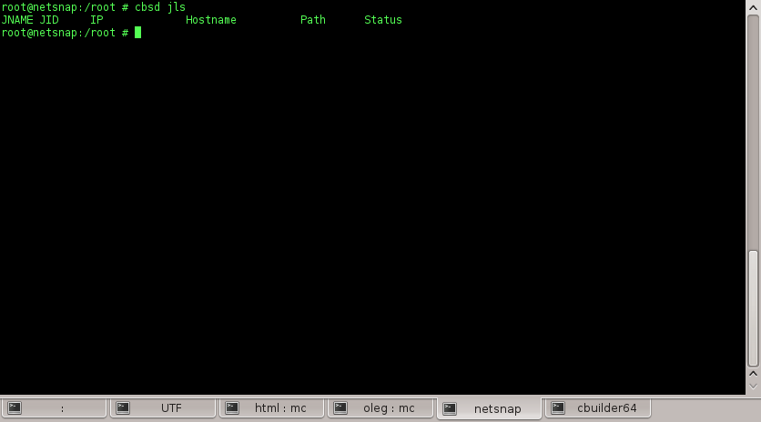
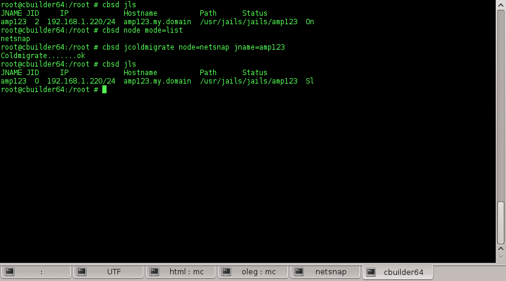
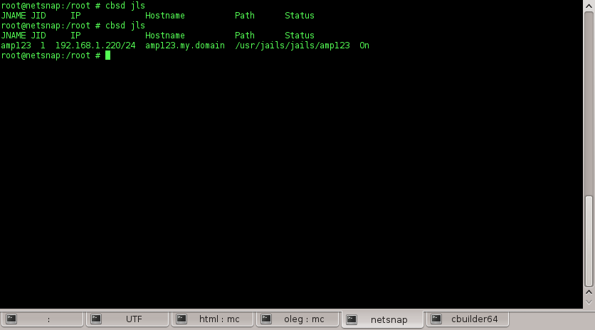

# Jail cold migration

**jcoldmigrate command**

```
% cbsd jcoldmigrate
```

**Description:**

**cbsd jcoldmigrate** does cold (with stoping) migration jail from one node to another. Argmument **node** point for destination node. Preliminary, RSA/DSA key for remote node must be added via **cbsd node mode=add** operation. Also, on a remote node service rsyncd should work (**cbsdrsync**).

By default, the jail status on a new node is inherited — if the jail worked, it also will be automatically started on a new node. If the jail didn't work — remains in Off status. To operate, what status should be on a remote jail not is dependent on a condition on the original, it is possible through parameter **start**.

Jail on the source, after successful jcoldmigrate will be stoped and switch to Slave status (unregister). In rc.conf file of jail on the destination node there will be a record where this jail came from.

Notes: For jcoldmigrate, the next action is performed (in process they pass automatically and aren't visible)

* copy configuration files to remote node, status of jail set to Slave on remote node (**cbsd j2prepare**)
* exec rsync, which does a full copy of the directory with data to remote node (**cbsd j2slave**)
* stop jails (if running) on the source node (**cbsd j2slave**)
* one more rsync job, for synchronization of those files which be modified
* switch jail status on source to Slave (**cbsd jswmode**)
* switch jail status to master on the remote node (**cbsd rexe + jswmode**)
* If jail was running — start jail on remode node (**cbsd rexe + cbsd jstart**)

**Example**

make cold migration for jail amp123 to netsnap node):

```
% cbsd jcoldmigrate node=netsnap jname=amp123
```

on the destionation node anything isn't present now:




from node cbuilder64 migrate jail amp123 to netsnap:



jail amp123 on netsnap was started automatically:


