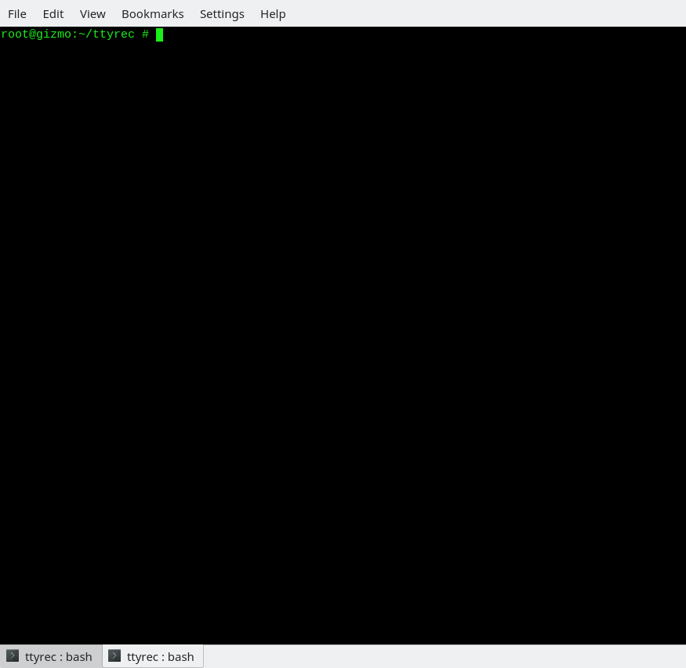
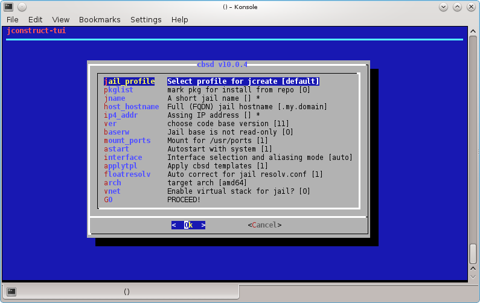
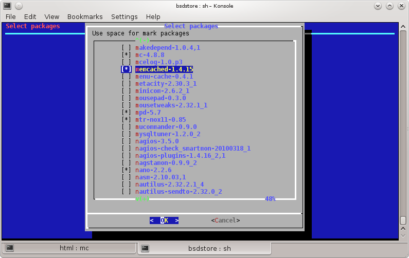
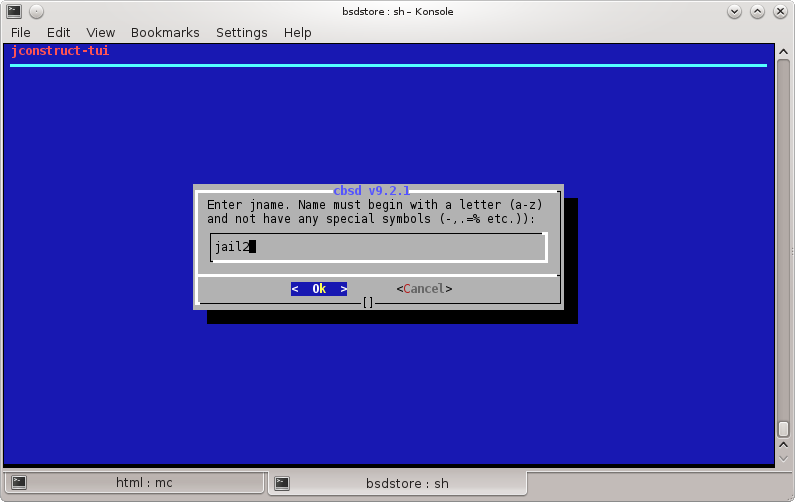
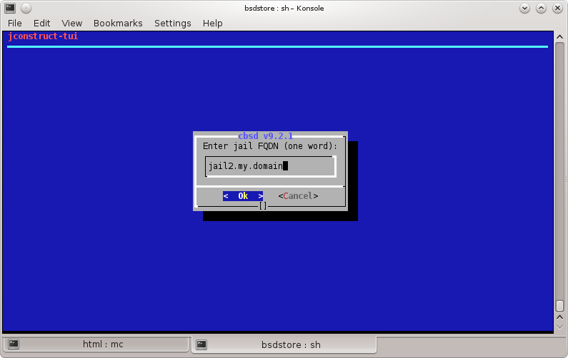
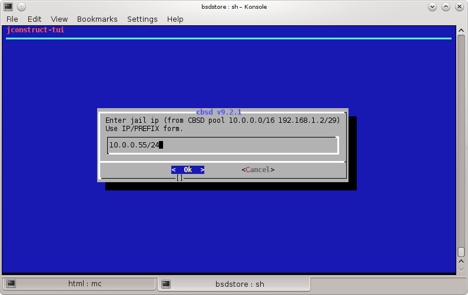
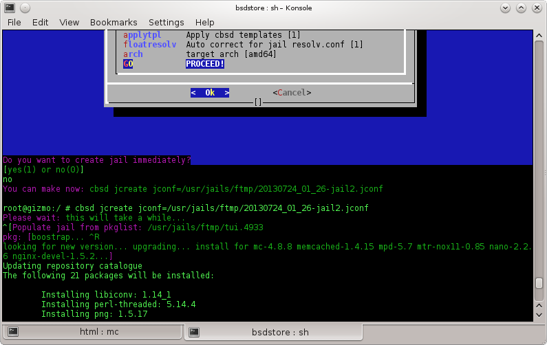

# Jail create via dialog menu

## CREATING JAILS

### commands: jcreate, jconstruct-tui

```
% cbsd jconstruct-tui

% cbsd jcreate jconf=/path/to/conf.jconf
```

**Description:**

The jail is created according to configuration file generated by **cbsd jcreate jconf=path_to_cfg**. For create configuration, use a command **cbsd jconstruct** (question-answer dialog mode), or [dialog(1)-based](http://man.freebsd.org/dialog/1) interface: **cbsd jconstruct-tui**, or via [WEB interface](https://clonos.tekroutine.com/). When [pkg.conf](https://wiki.freebsd.org/pkgng) and repository configured properly, you can preset to new jail some packages mark them through **pkglist** menu. For safety reason recommended to use the official FreeBSD **pkg** repo or **build your own** package repository.

Please note: when repo unavailable, item **pkglist** in **cbsd jconstruct-tui** did not show anything.

Please note: multi-repo and and the ability to choose a specific repository from the list at the moment is missing, and will be used repository prescribed in pkg.conf of master host.

```
*** Attention! *** Because the list and choose of packages formed by pkg.conf of master machine, keep in mind that the content of the selected packages on the list will only work if the architecture and version of the jail equal with master node
```

**Use the features of profiles:**

If you do not use automation (Puppet, Ansible, own implementation for generation of jconf) to create environments and you have to create a container with different parameters, use the ability to create your own [profile](https://www.bsdstore.ru/en/12.0.x/wf_profiles_ssi.html)to override the default values. You can override any parameter - the proposed template for jail name, version, binding to a specific interface instead of 'auto', etc..

for creating config via dialog:

```
% cbsd jconstruct-tui
```

The same menu is available to create a jail when configuring CBSD via bsdconfig


```
*** Let it not scare you a small ;-) the number of settings in jconstruct-tui - here are displayed only the most important options, suitable for most people. If you need a more flexible configuration - please use cbsd jconfig after jail creation
```
If **jconstruct-tui** work correctly, on the exit the question for jail create will be asked. In a case positively answer, **jcreate** it will be executed on a new configuration automatically. Otherwise, the script will save configuration file (in `$workdir/ftmp`), on which it is possible to create a jail by hand.


```
*** Important: ***

When a new jail is created or obtaining from the repository, make it a rule ALWAYS change the user's password root in jail, even if you do not plan to run it ssh/ftp/rsh and similar services. If the jail is created with applytpl=0, by default /etc/{passwd,master.passwd,group} in the jail as the original "clean" files FreeBSD, so password of root user is empty. If jail created with applytpl=1 (it also refers to images from repository) $workdir/share/jail-skel files will be used as templates where root password is 'cbsd' in default CBSD installation. You can change default root password when new jail is created via edit of hash in skel master.passwd via:

% vipw -d ${workdir}/share/jail-skel/etc

commands, or specify alternative path to jail-skel dir in .jconf (jcreate tools) config

```

You can override the `jailskeldir=$workdir/share/jail-skel`, parameters which is stored in `$workdir/etc/defaults/jail-freebsd-default.conf` to specify an alternate template directory, which will overwrite the files in the original base files when creating jail. To do this, create a file `jail-freebsd-XXXXX.conf` in `$workdir/etc` and enter the value.:

See for details:[Profiles for jail creation](https://www.bsdstore.ru/en/12.0.x/wf_profiles_ssi.html)

## DIALOG MENU OPTIONS


*  profile - profile in which the parameters are set by default. Described above
*  pkglist - Select package list for new jail
*  jname - Short (one word) name of the jail
*  host_hostname - FQDN for the jail environment
*  ip4_addr - specify IP addresses (separated by commas if more than one) or 0 for vnet/bhyve environments
*  ver - FreeBSD version for the base (10.1, 11.0 for RELEASE or 10, 11 for STABLE)
*  baserw - mount copy of base via nullfs in read only (baserw=no) or populate own copy (baserw=yes) with write access
*  mount_ports - mount /usr/ports dir from base system to jail (read only). To the environment can build ports (and not interfere with each other vorkdir) - reassigned WRKDIRPREFIX parameters to alternate location. Or, make sure that applytpl params is set to 1 - then CBSD does this automatically via `WRKDIRPREFIX=/tmp` in `/etc/make.conf` of the jail
*  astart - Automatic start jail on the system boot
*  interface - Specify uplink for jail (on what interface create/remove IP) or prohibit.
*  applytpl - Automatically adjust the same settings of the jail (create /etc/hosts, change WRKDIRPREFIX, etc..)
*  floatresolv - Automatically adjust /etc/resolv.conf from jnameserver IP (settings from initenv/initenv-tui)
*  arch - Specify architecture of jail environment
*  vnet - Enable or disable VIMAGE feature



**Example** (fill for jname, fqdn, ips fields + GO):

```
% cbsd jconstruct-tui
```


When repository configured properly, you can preset to new jail some packages. Use first character of name port for faster searching and hit space for mark it.



Required fields: a short (one word) the name of the jail. This name is used to identify the jail:



Required fields full (the domain) name of the cell. This name will be used as jail hostname:



Required fields: IP address of jail. May have a network prefix with a record like IP/prefix. To assign more than one IP address, use the editing of the file rc.conf jails described in [Jail config](https://www.bsdstore.ru/en/12.0.x/wf_jconfig_ssi.html)



When you choose item **GO**, you are prompted to create the jail immediately by automatically running **cbsd jcreate jconf=...** Otherwise, you will be the path to the saved configuration to run **cbsd jcreate** by hand:



