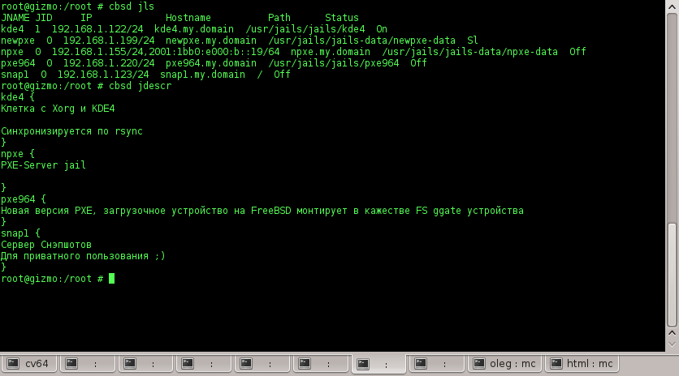
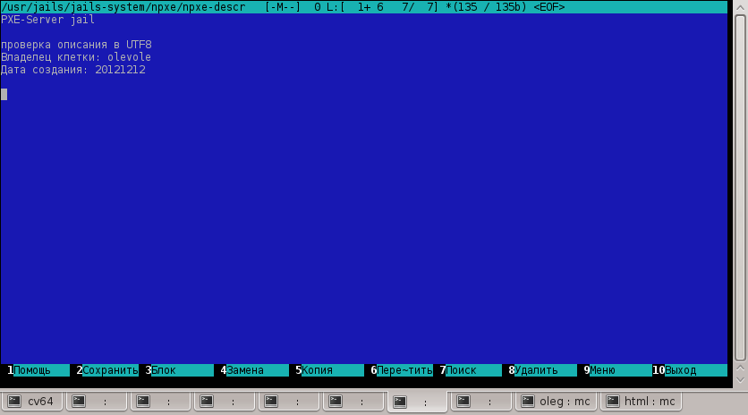

# Jail description

**jdescr command**

```
% cbsd jdescr
```
**Description**

Each jail can have an optional description/summary. With this it is possible to generate dynamic documentation on admin pages. Using **cbsd jdescr** by itself outputs a description of all local jails.

Command

```
% cbsd jdescr mode=update jname=jname
```
runs **nvi** in edit mode and opens the description of the jail specified by **jname**. If you prefer using a different editor such (such as vim or **mcedit** it can easily be done by passing your choice with the **editor** variable. Descriptions for each jail are stored in a text file residing at `$workdir/jails-system/$jname/descr`, where **jname** is the name of the jail. When a jail is moved or copied with jcoldmigrate, jclone, jimport/export operations, the description will remain the same.

**Example** (running mcedit to modify the kde4 jail using russian UTF8 charset):

```
% setenv LANG ru_RU.UTF-8
% cbsd jdescr jname=kde4 editor=mcedit mode=update
```
It is advisable to maintain meaningful descriptions as your collection of jails grows. In addition it can be quite convenient to aggregate this information in order to create dashboards and build jail maps. One example of how this could look is the following simple script: [jmap2html.sh.html](files/jmap2html.sh) which generates an overview in the form of a HTML page [dashboard sample](https://www.bsdstore.ru/en/misc/dashboard/index.html)





