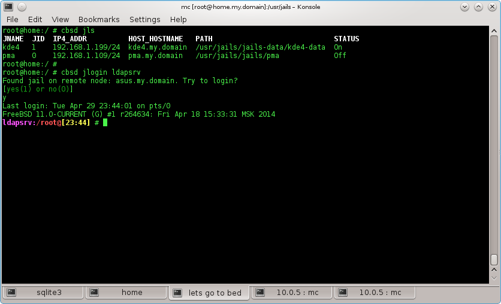
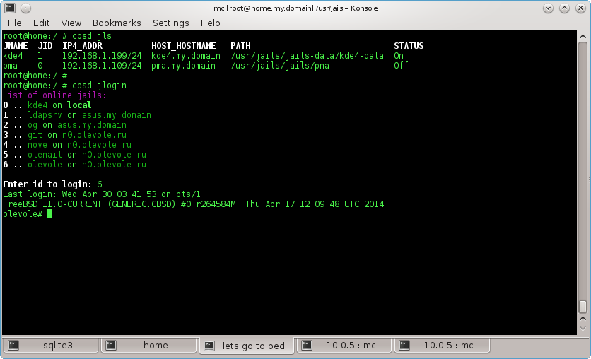

# Jail login

**jlogin command**

```
% cbsd jlogin
```
**Description:**

Performs a login to the jail as root user. If the jail isn't present on the local node, but rather on one of the remote nodes, **jlogin** will attempt to login over ssh.

If no jail is specified, a list of all known online jails in the farm is displayed (provided remote hosts were added).

If you remotely connect to a jail and node which have **tmux** installed, tmux will be launched at login and the session is given the name taken from the server's nodename (taken from jlogin).

Additional sessions will automatically join the tmux session through a **tmux-attach**. When the last connection is closed the **tmux** session ends (you may detach via **Ctrl + b** , **d** to keep it running).

Should you prefer **NOT** to use **tmux** on jlogin, copy `${workdir}/defaults/jlogin.conf` to `${workdir}/etc/jlogin.conf` and set tmux_login to 0.

In order to deactivate "try to login?" when logging in to remote nodes, set always_rlogin to 1 in your `${workdir}/etc/jlogin.conf`.

**Example:**

```
% cbsd jlogin kde4
```
Starting with the version of CBSD 11.1.2, you can customize the command, redefining the action on you more suitable

This is achieved through the configuration file blogin.conf and the parameter **login_cmd**.

The file can be placed for the individual environment in the directory `$workdir/jails-system/$jname/etc`, and globally, overwriting the value from `$workdir/etc/defaults/blogin.conf`. To do this, create a file with your configuration in the directory `$workdir/etc/`

With a custom call, you can use CBSD variables - for this or that environment

For example, if you want instead of the standard behavior, when the blogin lauched ssh client, the file `$workdir/etc/blogin.conf` can look like this:

```
  login_cmd="/usr/bin/ssh your_user@${ipv4_first}"
```




