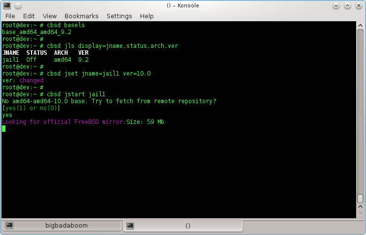
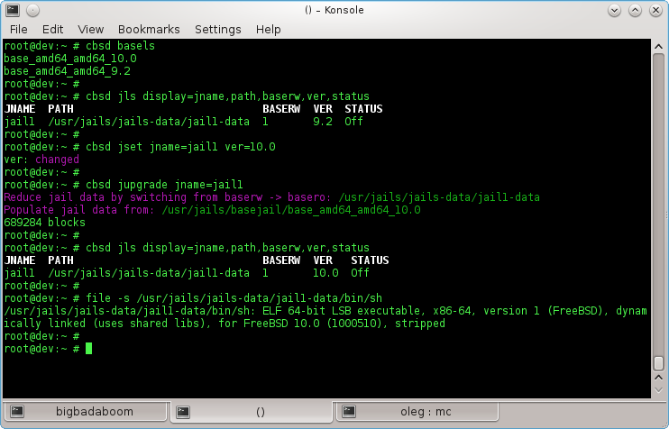
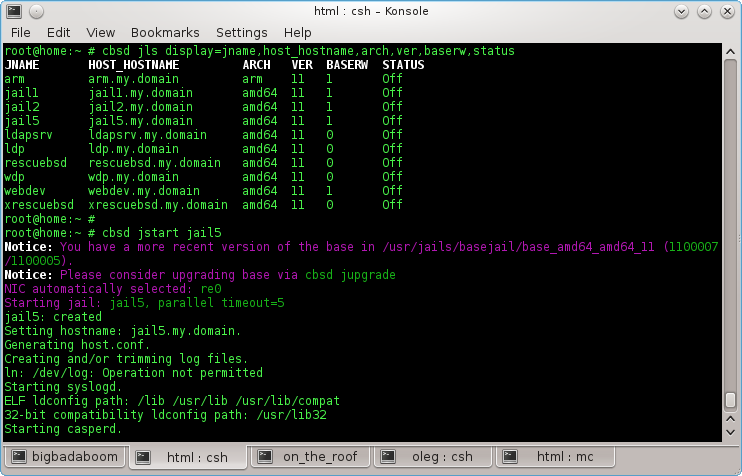

# Jail upgrade

## Warning

**Description:**

Upgrade procedure jail always carries certain risks in the form of disruption of service, therefore, make it a rule to always create backups of the jail. If you are running on ZFS file system, you can use the command [cbsd jsnapshot](https://www.bsdstore.ru/en/12.0.x/wf_jsnapshot_ssi.html) for a frozen state of the jail before the start of work. For example:

```
% cbsd jsnapshot mode=create jname=jail1 snapname=before_update
```
and the end of work, if all ok, remove snap through:

```
% cbsd jsnapshot mode=destroy jname=jail1 snapname=before_update
```
If the file system is UFS, you can create an image of the jail through:

```
% cbsd jexport jname=jail1
```
And in the case of success, remove the image jail1.img from `$workdir/export` directory. An upgrade jail **CBSD**, we assume only update files base FreeBSD. Upgrade procedure 3rd-party software in jails similar to upgrade in the non-jail system. You can update the database as between different versions of the system (eg from version 9.2 to FreeBSD 9.3 or FreeBSD 9.3 -> FreeBSD 10.1), and update the files within the same version. It should be remembered that the jails have two modes — **baserw=1**, when the base part of each jail — have their own copy located in the directory `$workdir/jails-data/$jail`, and **baserw=0**, when one and the same base dir `${workdir}/basejail/base_\*_\*_ver` mounted to all jails.

## Jupgrade command

```
% cbsd jupgrade
% cbsd jconfig
```

### Upgrading the basejail

```
% cbsd jset
```

This time, the idea is to set the basejail version of the target jail to that of the desired FreeBSD release. We achieve this by successively: shutting down the jail, setting the appropriate version tag, starting the jail. In case we specified a version for which we don't already have the base, it will be downloaded at jail startup.

```
% cbsd jstop XXX
% cbsd jset jname=XXX ver=11.2
% cbsd jstart XXX
```
### Upgrading via freebsd-update

[freebsd-update](http://man.freebsd.org/freebsd-update/8) can be used without a reference to **CBSD**. Note that the utility works with the official FreeBSD resource and configure it to the repository CBSD is impossible, those only one source.

Update files for base jail through freebsd-update can via specified key -**b** path to directory which used by **CBSD** when mounting jail **baserw=0**. For example, if your cbsd `$workdir - /usr/jails`, then for amd64 and version 10.0 is the path to base: /usr/jails/basejail/base_amd64_amd64_10.0. This directory should be updated:

```
% freebsd-update -b /usr/jails/basejail/base_amd64_amd64_10.0 fetch
% freebsd-update -b /usr/jails/basejail/base_amd64_amd64_10.0 install
```

If you do not have baserw=1 jail, then its the end. If baserw=1 jails exists, to update them there are two possibilities:

*  As in the case above, for each jail cause freebsd-update and specify the path to **data** directory of the jail (`$workdir/jails-data/$jname`)
*  Or, after basejail upgrade as described above, execute:

```
cbsd jupgrade jname=XXXX
```
 for each baserw=1 jail - this command reshapes base ( `$workdir/jails-data/$jname` ) of the jail from the `$workdir/basejail/*` files

### Upgrading baserw=0 jails between different versions of the bases via CBSD

Option with the upgrade jail in mode **baserw=0** to a new version base is the easiest is to change the version in the configurator

```
% cbsd jconfig jname=XXX
```
Since in this case only changes the source directory that link on start jail. Example of updating jail from 9.2 to 10.0 version.

Baseline: there x86-64 system with a base of FreeBSD 9.2 and jail jail1 on this base, upgrade to 10.0.

When jail is stopped, we go in the configurator via


```
% cbsd jconfig jname=jail1
```

and change ver parameter to **10.0**, then save it via "Commit". Or, as in the screenshot — do change through cbsd jset

On the next run, the jails will mount base 10.0 (on screenshot the base in the system not found and **CBSD** has invited her to download). Of course, with such a upgrade to a new major version, after this operation you need to rebuild the software in the jail or update it through **pkg** — operation is highly desirable because library system changed. As a minimum, to identify this fact we can use the **libchk** utils.



### Upgrading baserw=1 jails between different versions of the base via CBSD

Upgrade of **baserw=1** takes a different scenario, since on this operation CBSD will overwrite the old base system files to the new in jail data directory `$workdir/jails-data/$jname`.

Baseline: we need uprgade jail jail1 **baserw=1** mode (in-law, its root path PATH points in jls pointed to jails-data, rather than jail directory) from 9.2 to 10.0 version.

Verify through the **file** utility, which reads ELF table that file /bin/sh of jails belongs version 9x. And in the same way, check the version of the file after the upgrade:

```
% file -s /usr/jails/jails-data/jail1-data/bin/sh
/usr/jails/jails-data/jail1-data/bin/sh: ELF 64-bit LSB executable, x86-64, version 1 (FreeBSD), dynamically linked (uses shared libs), for FreeBSD 9.2, stripped
```

When stopped jails perform change version through **cbsd jconfig or cbsd jset**, then perform the upgrade procedure:

```
% cbsd jupgrade jname=jail1
```
This operation causes the system to overwrite all the files in the base jail from your base original directory `$workdir/basejails/base_\*_\*_ver`




There are cases when you need to upgrade the files in one version, for example, base 10.0 to 10.0-p1. For jails who have mounted base through nullfs (baserw=0), simply re-download the `$workdir/basejail/base_\*_\*_ver` directory to more recent version. For this you can use the command:

```
% cbsd repo action=get sources=base mode=upgrade
```

- flags **mode=upgrade** permits to **CBSD** overwrite this directory with new files, if you already have a version of the base for this version. Or, you can build a more recent version of the base, using [Building and upgrading bases](https://www.bsdstore.ru/en/base_cbsd.html) Also, you can go with the base version with a RELEASE to STABLE (in this case, the name of the base directory will not X.Y, just X. Ie, instead base_\*_\*_9.2 will be used base_\*_\*_9 directory. For this you need in configurator of jail (cbsd jconfig) change the parameter stable=0 to stable=1 (either through cbsd initenv-tui mode is set STABLE branches globally), and do not forget to add stable=1 flags in repo command (if not set globally)

```
% cbsd repo action=get sources=base mode=upgrade stable=1
```
Similar rules for jails with baserw=1, it is only necessary to remember after update in **CBSD** to start the update process files by **cbsd jupgrade**

In addition, provided that you have a base system in the corresponding version (or you jail migrated to another server where there is a base more recent), when you start the jail with baserw=1, **CBSD** can automatically check for more recent files for this version and show information message "You have a more recent version of the base in ...":



### Update of configuration files in jail, etcupdate/mergemaster


// to be continued

